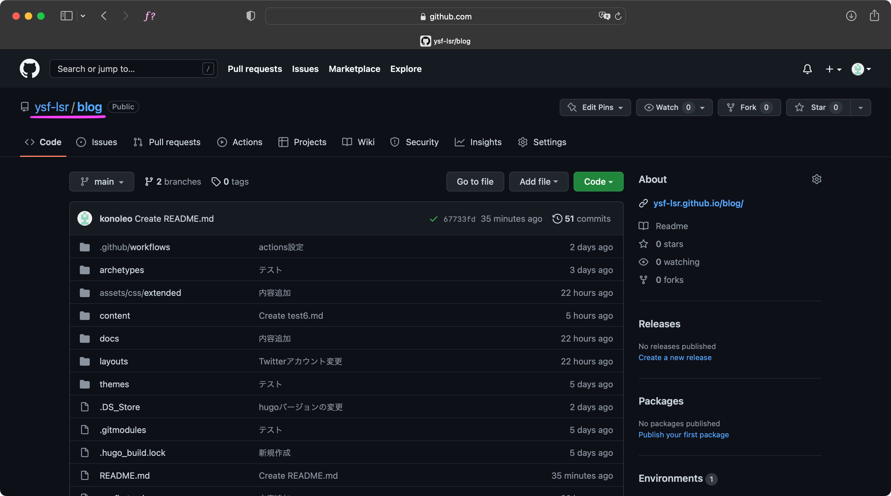
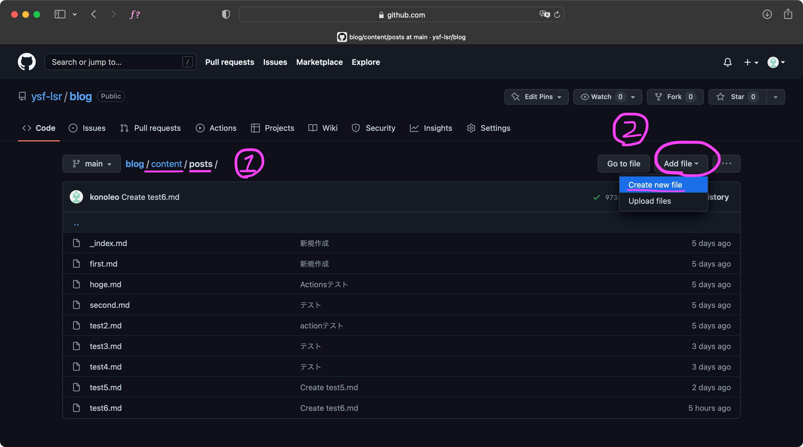
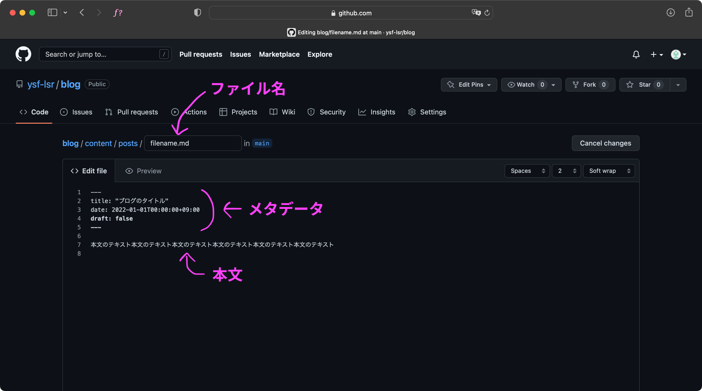
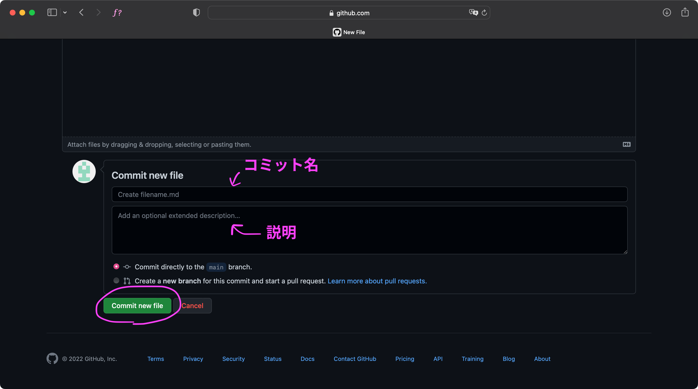
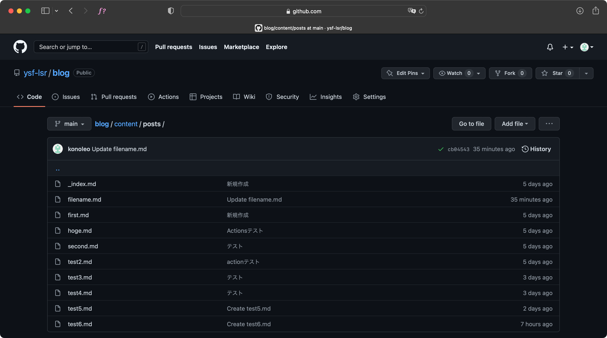
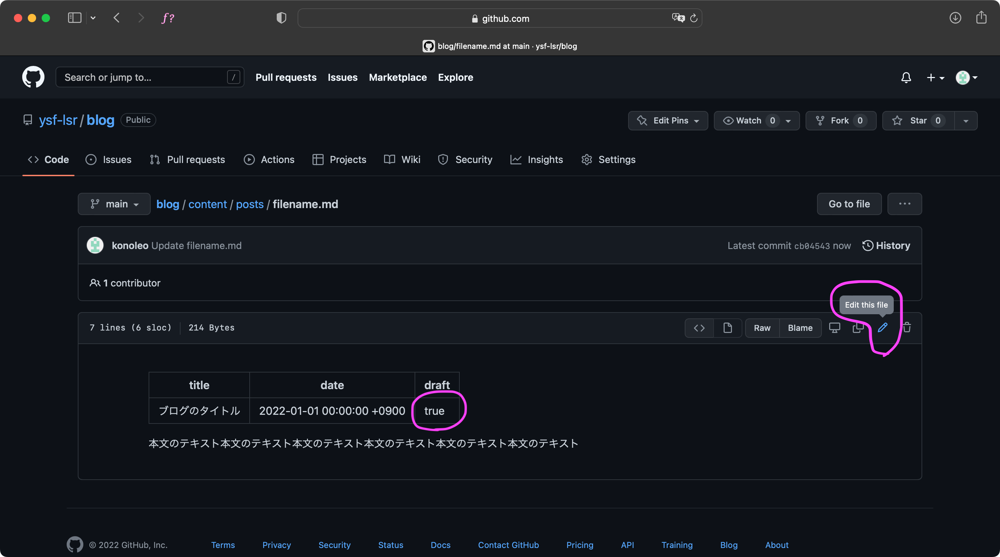
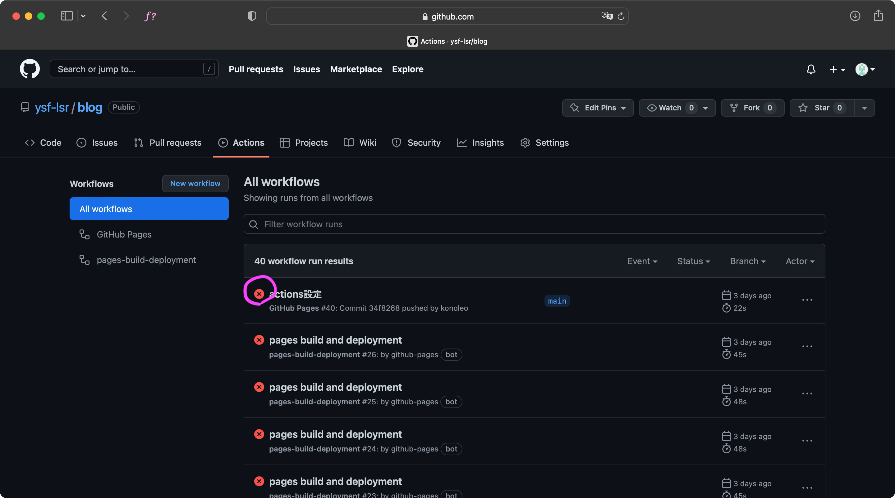

# ブログの書き方

## GitHubアカウントの作成

[1分もかからない！5ステップでGitHubアカウント作成](https://reffect.co.jp/html/create_github_account_first_time)を参考にしてアカウント作成をしてください。

画面は全て英語ですが、簡単な英語がほとんどなので、自力か機械翻訳でなんとかなります。

## 団体に参加

アカウントを作り終わったら、「YSF Light Side Robotics」に参加しなければいけないので、すでに参加している人にアカウントを教えてください。参加できたらブログを書けるようになります。

## ブログを書く

### アクセスする

「[ysf-lsr/blog](https://github.com/ysf-lsr/blog)」という名前のリポジトリ（ここ）にアクセスします。

「content」→「posts」にアクセス、右上の「Add file」→「Create new file」をクリックしてください。

### ブログを書く

#### ファイル名
「ファイル名」は英数字のみでお願いします。「.md」を必ず最後につけてください。

#### メタデータ
「メタデータ」の説明をします。
- title  
ブログのタイトル。「"」（ダブルクォーテーション）で囲んでください。
- date  
書いた日時。「年年年年-月月-日日T時時:分分:秒秒+09:00」というフォーマットです。
- draft  
下書きかどうか。trueだとサーバーには保存されますが公開されません。falseだと公開されます。

「メタデータ」は重要な行なので、絶対に消さないでください。

#### 本文
「本文」は、Markdownという書き方を使って書いてください。[このサイト](https://tech-blog.rakus.co.jp/entry/20200624/markdown)とかが参考になります。

## アップロード

下にスクロールし、「Commit new file」をクリックしてください。

ちなみに、この画面は変更しなくていいです。（「コミット名」は変更のタイトル、「説明」は変更の説明ですが、「コミット名」は自動で登録され、「説明」はなくてもいいため）

特にエラーが起きなければ「Create new file」を押す前の画面に戻るはずです。

## 確認

[公式サイトのブログページ](https://ysf-lsr.github.io/blog/posts/)にアクセスして、さきほど投稿したブログがあるか確認してください。

### 見つからなかった時

#### 「メタデータ」の「draft」が「true」になっている
下書き設定になっているので、「false」に書き換えてもう一度アップロードしてください。

#### GitHubでエラーが起こっている
[GitHub Actions](https://github.com/ysf-lsr/blog/actions)にアクセスしてください。赤いバツ印があればエラーが起こっています。サイトの作成者など詳しい人に言ってください。

#### キャッシュが残っている
キャッシュとは、一から読み込まなくて済むように、アクセスしたサイトなどのデータを一時的に保存する機能のことです。このせいで、ブラウザが「どうせ変わってないからキャッシュ使えばいいや」と思ってしまい、更新がすぐには反映されなくなります。

しばらく経てば「そろそろ変わってるかな？」と思ってくれるので放っておけばいいですが、すぐ確認したい時は「スーパーリロード」をしてください。（[スーパーリロードのやり方](https://logo-tank.net/ltw/tips/20210318.html)）