FLL2021-2022の全国大会で決まった「[Razorback Open Invitational](https://fllrazorback.com)」への出場。大会本番についてタイムライン形式でお伝えします。

## ピット最終選考に残りました
5/21 09:02（現地時間）  
ピット最終選考に残りました！
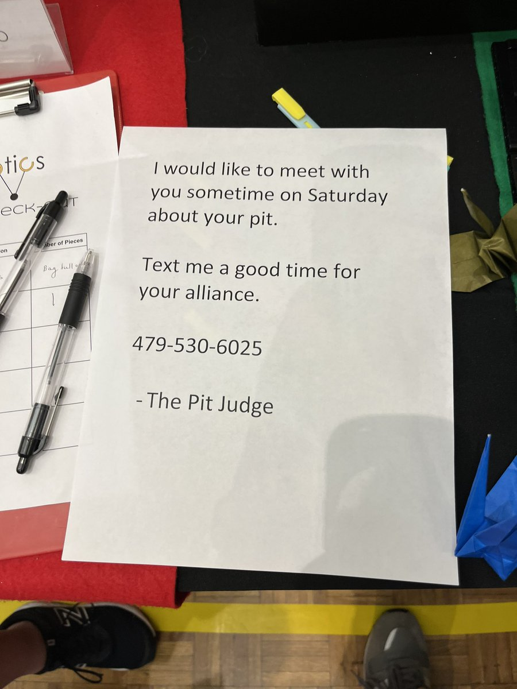

## ロボデザ
5/20 22:33（現地時間）  
ロボデザコールバックゲットです！ 明日も頑張るぞ


## ピット完成
5/20 18:33（現地時間）  
私たちのピットが出来ました✌️  
アライアンスチームのHeroboticsと一緒に最高のピットが完成です。アルコールロボット「あるロボ」も大人気！  
世界の人達はとてもフレンドリーで話すのが楽しいです😊  
これからタレントショーです。僕らは習字🖌をやります！頑張るぞ！「一世一代FLL」
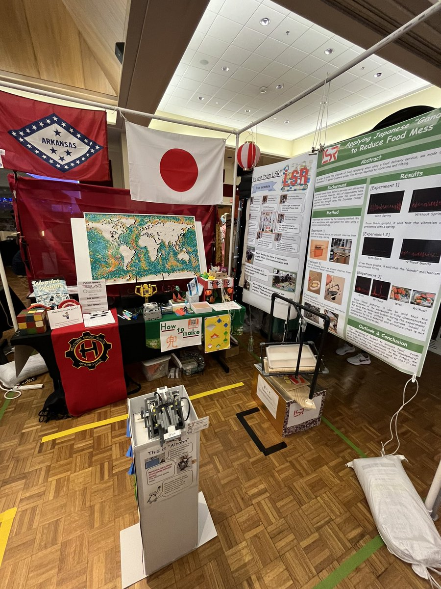

## ホテルの部屋
5/20 05:39（現地時間）  
ホテルの部屋です。すごく綺麗！


## 開会式終了
5/19 20:50（現地時間）  
開会式終わりました。めっちゃ楽しかった！ 配信は[こちら](https://www.twitch.tv/videos/1488556366)
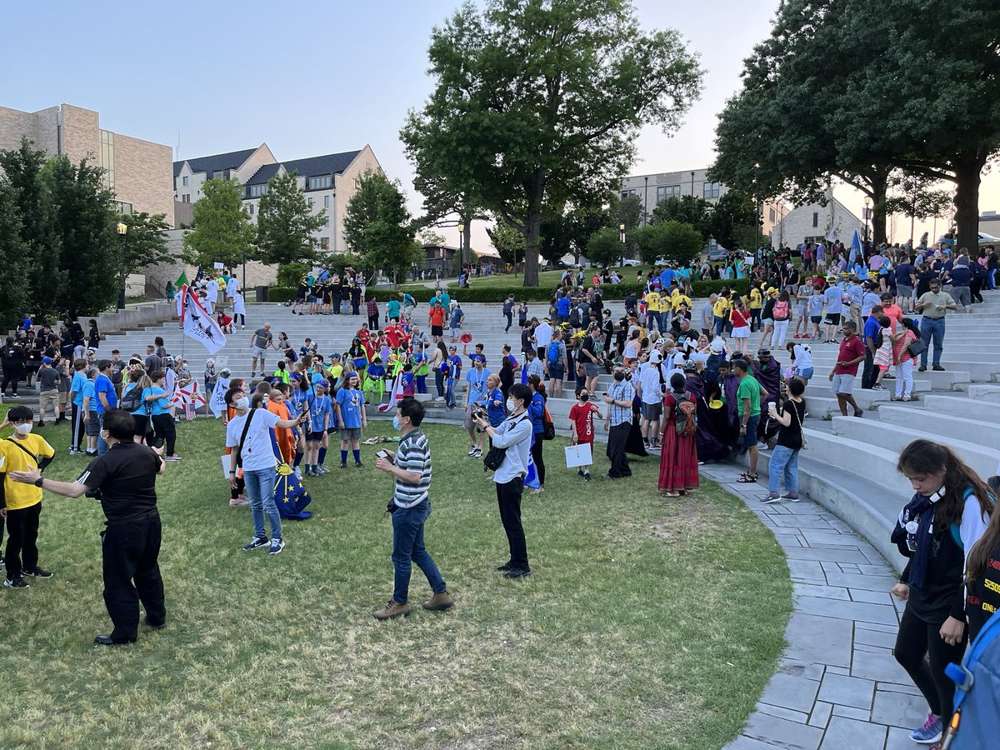

## 開会式開始
5/19 19:32（現地時間）  
開会式始まりました！ いよいよって感じがします、、、正直緊張もあるけど頑張ります
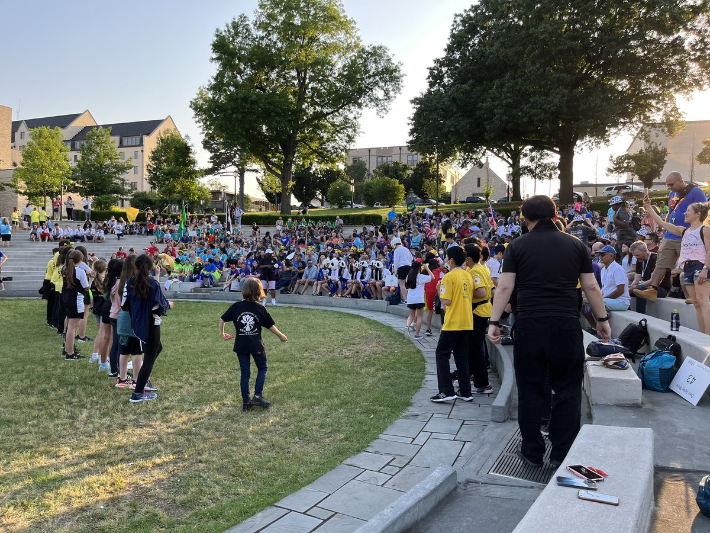

## 世界地図
5/19 17:12（現地時間）  
Heroboticsすごい！👏🏻 クオリティの高い地図です！
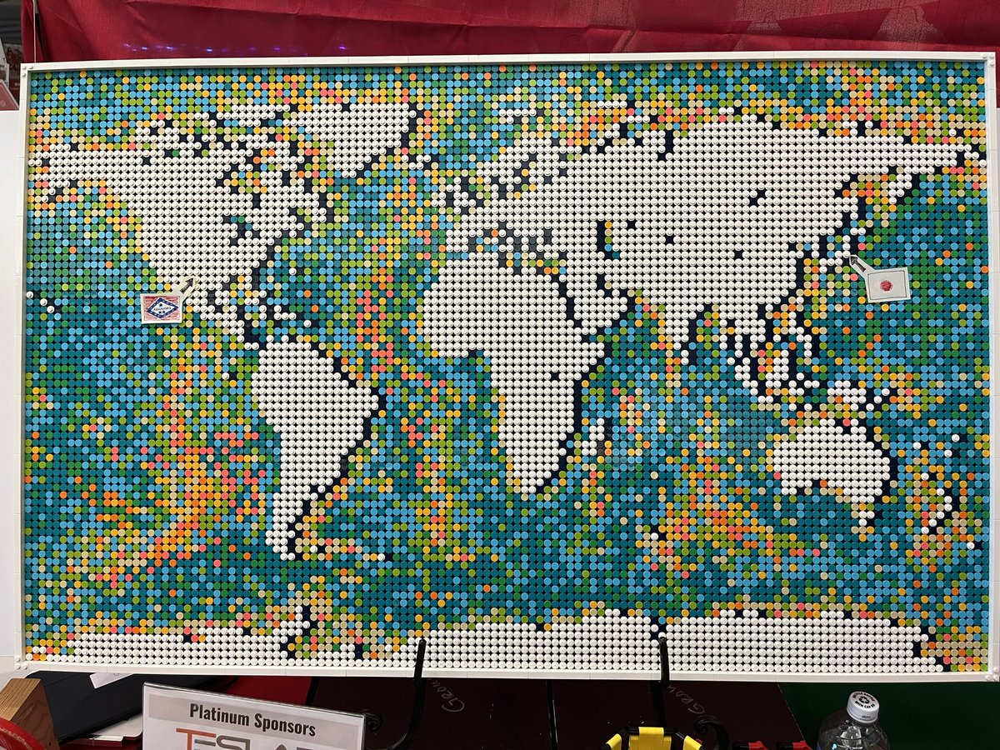

## 会場ができていく
5/19 15:35（現地時間）  
ピットが出来ていく！ 本番が近づいています。
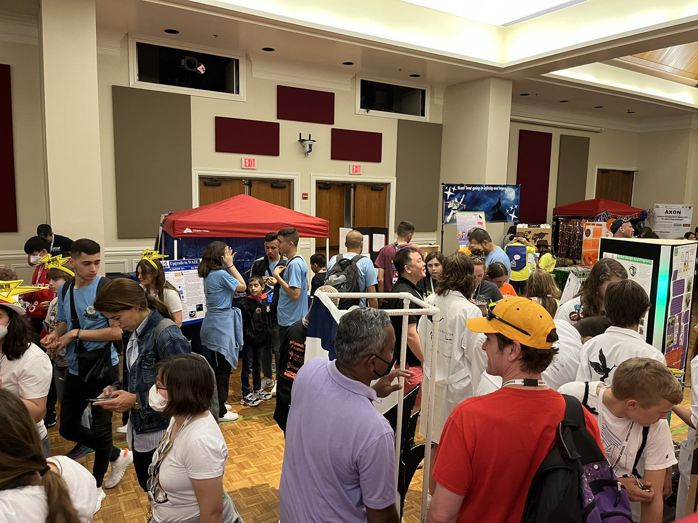

## 会場で練習
5/19 13:24（現地時間）  
会場で練習中。
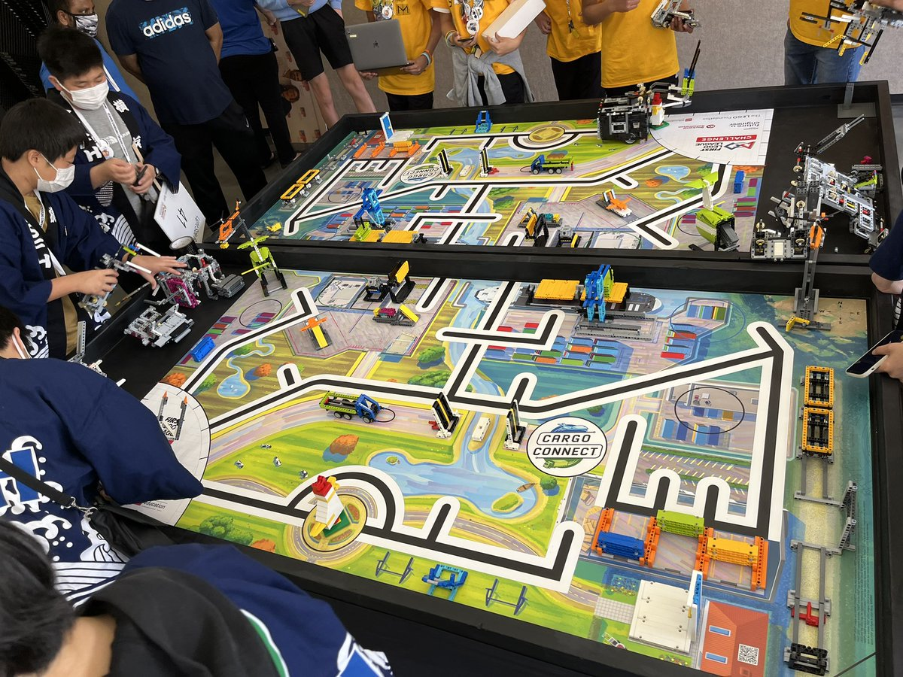

## 会場の写真
5/19 10:22（現地時間）  
会場の写真です。楽しみ！ 
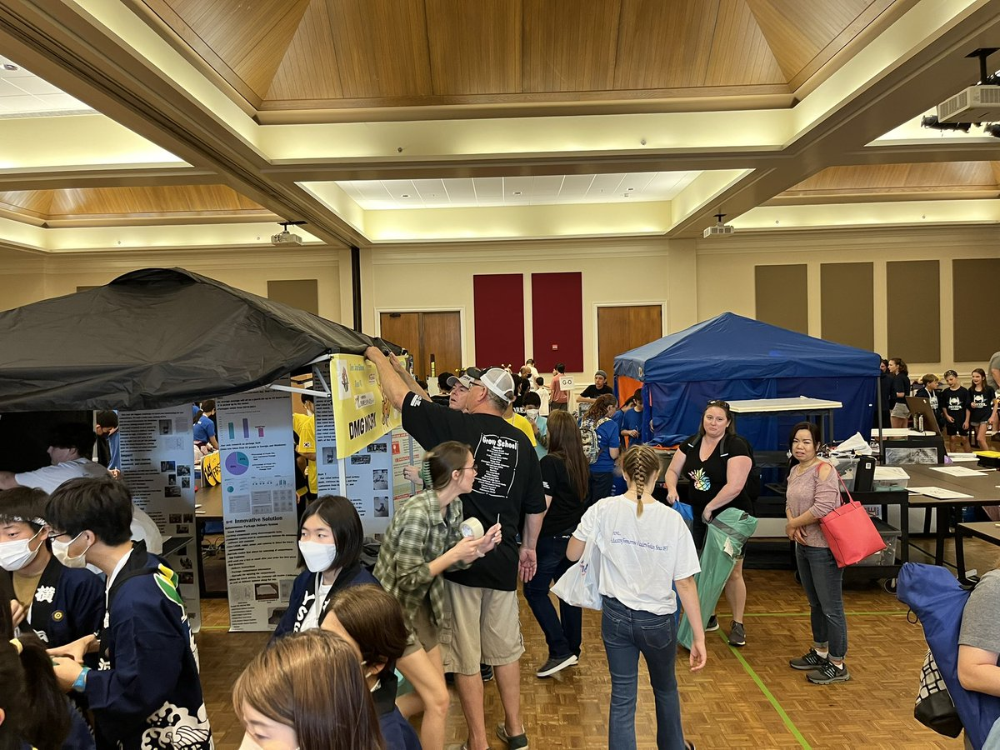

## 部屋で練習
5/19 08:27（現地時間）  
ホテルの部屋に着きました。ロボットの操作中です。
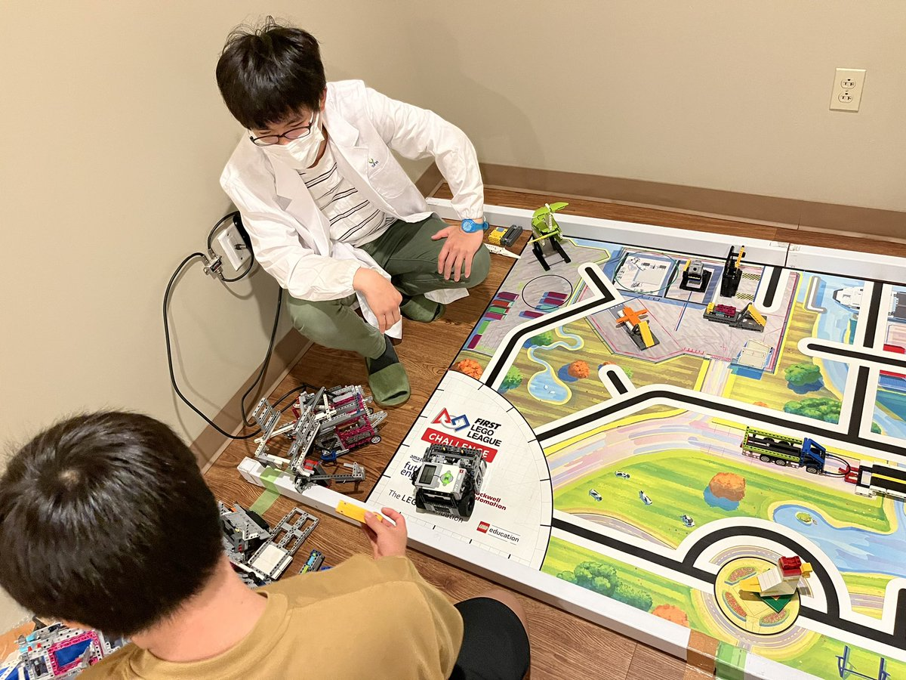

## 大学到着
5/18 15:49（現地時間）  
アーカンソー大学に着きました。緑がいっぱいの綺麗な大学です。
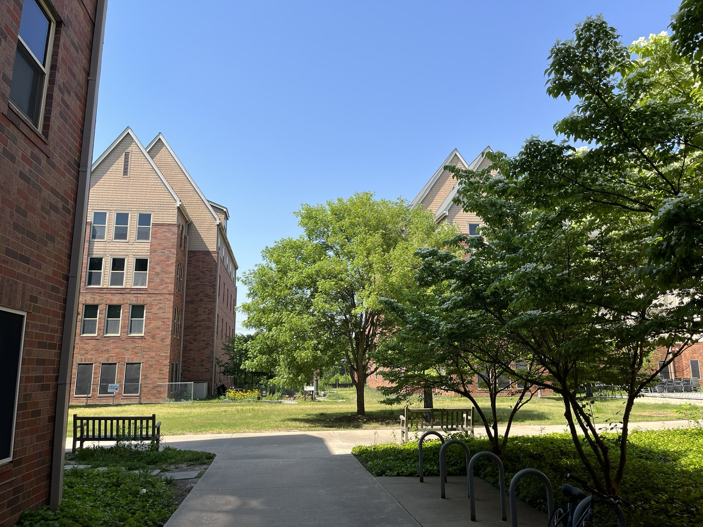

## ダラス到着
5/18 08:50（現地時間）  
アメリカのダラスに着きました！ これからアーカンソーに向かいます。
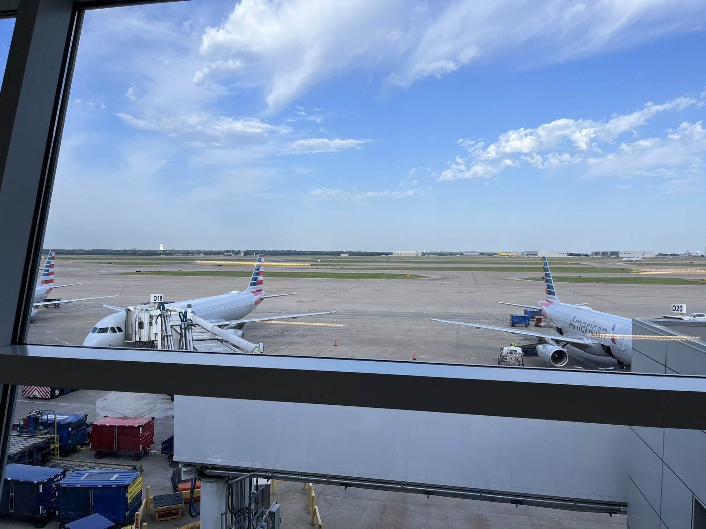